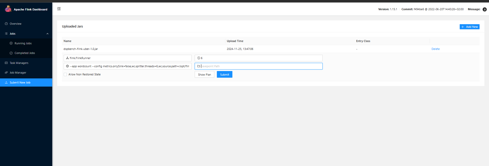

# fault-tolerance-flink

### OBS: The dspbench-flink module of this repo is a copy of the https://github.com/GMAP/DSPBench repo. The .jar files in the flink-WC and flink-kafka directories are slight modifications of the code you can find inside this module. 

## SETUP

You'll need:
  - Docker
  - Compatible image versions of Flink, Kafka, Grafana and Prometheus.

### Step 1:
Choose one of the applications, WC or kafka.

In a terminal inside the chosen directory, run:

```bash
docker compose up
```

This will bring the containers up and let you access the Flink UI at http://localhost:8081

### Step 2 (WC):
Now you can add a new job application as shown in the following screen:



Select the .jar inside the ``flink-W``C directory.

Set the entry class as ``flink.FlinkRunner`` and paste the following command line options:

```
--app wordcount --config metrics.onlySink=false,wc.splitter.threads=6,wc.source.path=/opt/flink/book.dat,wc.parser.threads=2,metrics.enabled=true,wc.counter.threads=1,metrics.output=/metrics/stream/WC/,wc.kafka.source.topic=books,wc.kafka.zookeeper.host=10.32.45.44:9092,wc.sink.threads=1,wc.source.class=flink.source.FileSource,wc.source.threads=1,wc.sink.class=flink.sink.ConsoleSink,metrics.interval.unit=seconds,wc.runtime_sec=600
```

You can then check your job running at ``Running jobs``.

### Step 2 (kafka):
Same way as WC, you need to start the flink application.

Select the .jar inside the ``flink-kafka`` directory.

Set the entry class as ``flink.FlinkRunner`` and paste the following command line options:

```
--app wordcount --config metrics.onlySink=false,wc.splitter.threads=6,wc.source.path=/opt/flink/book.dat,wc.parser.threads=2,metrics.enabled=true,wc.counter.threads=6,metrics.output=/metrics/stream/WC,wc.kafka.source.topic=books,wc.kafka.zookeeper.host=kafka:9092,wc.sink.threads=1,wc.source.class=flink.source.KafkasSource,wc.source.threads=1,wc.sink.class=flink.sink.ConsoleSink,metrics.interval.unit=seconds,wc.runtime_sec=600
```

Now you have flink listening to all events inside the Kafka topic.
To populate this topic, you should log in the Kafka Container and run the ``untitled-1.0-SNAPSHOT.jar`` that was mounted inside ``/home``.
This binary file receives a time, in seconds, as input and run for this long a loop sending events do kafka.

To execute the .jar run:
```
java -jar untitled-1.0-SNAPSHOT.jar <time>
```